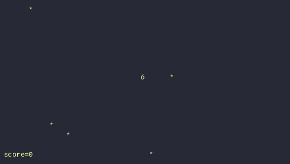
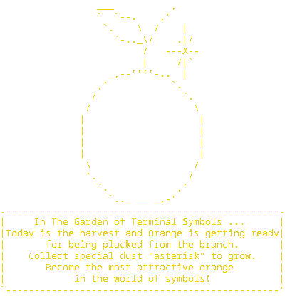

<h1>orange.sh</h1>

 
<a href="https://github.com/everydayikillmylinux/orange-sh/wiki/Installation-&-Usage-Guide-Wiki">HOW-TO Install & Usage</a>

## Notes

You can increase the number of asterisks at the beginning of the .sh file you want to eat!

Movement keys: `W`,`A`,`S`,`D` or `H`,`J`,`K`,`L`

Close game: `Q`, `Ctrl+C`

 
Special thanks to <a href="https://github.com/raylduk8">raylduk8</a> for this precious storyline

